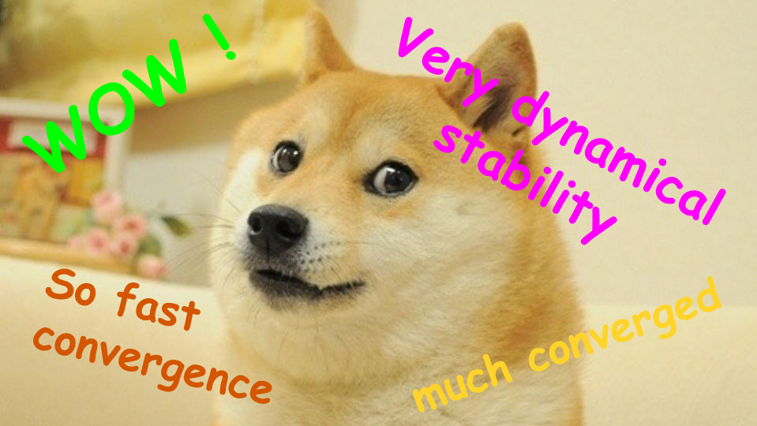

```@meta
EditURL = "https://github.com/dylanfesta/SmoothedSpectralAbscissa.jl/blob/master/examples/02_dynamics.jl"
```

# Faster convergence for linear dynamcs

In this example, I show how the SSA can be used as objective to guarantee
convergence or faster convergence for a linear dynamical system.

## Optimization of all matrix elements

### Initialization

```@example 02_dynamics
using Plots,NamedColors
using LinearAlgebra
using Random
using SmoothedSpectralAbscissa ; const SSA=SmoothedSpectralAbscissa
Random.seed!(0);
nothing #hide
```

### Linear Dynamics

Consider continuous linear dynamics, regulated by
```math
\frac{\text{d} \mathbf{x}}{\text{d}t} = A \mathbf{x}
```
The soluton is analytic and takes the form:
```math
\mathbf{x}(t) = \exp( A\,t )\;\mathbf{x}_0
```
Where $\mathbf{x}_0$ are the initial conditions. The function below computes the dynamical
evolution of the system.

```@example 02_dynamics
function run_linear_dyn(A::Matrix{R},x0::Vector{R},tmax::Real,dt::Real=0.01) where R
  ts = range(0,tmax;step=dt)
  ret = Matrix{R}(undef,length(x0),length(ts))
  for (k,t) in enumerate(ts)
    ret[:,k]=exp(A.*t)*x0
  end
  retnrm = mapslices(norm,ret;dims=1)[:]
  return ts,ret,retnrm
end;
nothing #hide
```

### The optimization of the objective is done through Optim.jl and BFGS

```@example 02_dynamics
using Optim

function objective_and_grad_simple(x::Vector{R},grad::Union{Nothing,Vector{R}},
    n::Integer,ssa_eps::R,alloc::SSA.SSAAlloc) where R
  mat=reshape(x,(n,n))
  gradmat = isnothing(grad) ? nothing : similar(mat)
  obj = SSA.ssa_simple!(mat,gradmat,alloc,ssa_eps)
  if !isnothing(grad)
    for i in eachindex(gradmat)
      grad[i]=gradmat[i]
    end
  end
  return obj
end;
nothing #hide
```

### Start with an unstable matrix

```@example 02_dynamics
n = 50
A = randn(n,n) ./ sqrt(n) + 0.2I
x0=randn(n)
times,_,dyn_norms = run_linear_dyn(A,x0,3.,0.1)

plot(times,dyn_norms; leg=false,linewidth=3,color=:black,xlabel="time",ylabel="norm(x(t))")
```

as expected, the norm grows exponentially with time.

### Now do the gradient-based optimization

```@example 02_dynamics
const ssa_eps=0.001
const alloc = SSA.SSAAlloc(n)
const y0 = A[:];
nothing #hide
```

The objective function to be minimized is
```math
\text{obj}(A) = \text{SSA}(A) + \lambda \frac12 \left\| A - A_0 \right\|^2
```
Where $\lambda$ sets the relative weight.
We are reducing the SSA while keeping the matrix elements close to their initial value.
Adding some form of regularization is **always** necessary when otpimizing. If not,
the SSA would run to $-\infty$.

```@example 02_dynamics
function objfun!(F,G,y)
  λ = 50.0/length(y) # regularizer weight
  obj=objective_and_grad_simple(y,G,n,ssa_eps,alloc) # SSA and gradient
  ydiffs = y.-y0
  obj += 0.5*λ*mapreduce(x->x^2,+,ydiffs) # add the regularizer
  if !isnothing(G)
    @. G += λ*ydiffs # add gradient of regularizer
  end
  return obj
end;
nothing #hide
```

### Optimize and show the results

```@example 02_dynamics
opt_out = optimize(Optim.only_fg!(objfun!),A[:],BFGS(),Optim.Options(iterations=50))
y_opt=Optim.minimizer(opt_out)
A_opt = reshape(y_opt,(n,n))
times,_,dyn_norms_opt = run_linear_dyn(A_opt,x0,3.,0.1)
plot(times,dyn_norms_opt;
  leg=false,linewidth=3,color=:blue,xlabel="time",ylabel="norm(x(t)) optimized")
```

The optimized matrix produces stable dynamics, as shown in the plot above.

We can also take a look at the matrices before and after optimization

```@example 02_dynamics
heatmap(hcat(A,fill(NaN,n,10),A_opt);ratio=1,axis=nothing,ticks=nothing,border=:none,
  colorbar=nothing)
```

The optimized version simply has negative diagonal terms.

This may appear a bit trivial. In the next part, I optimize a system *excluding* the diagonal.

## Optimization that excludes the diagonal

Here I consider a matrix that is stable, but produces a large nonlinear amplification.
It is generated by the function:

```@example 02_dynamics
function rand_nonnormal(n::Integer,(ud::Real)=1.01)
  mat = randn(n,n) ./ sqrt(n)
  @show SSA.spectral_abscissa(mat)
  mat = mat -  (1.1*SSA.spectral_abscissa(mat))*I
  sh = schur(mat)
  upd = diagm(0=>fill(1.0,n),1=>fill(ud,n-1))
  return sh.vectors*upd*sh.Schur*inv(upd)*sh.vectors'
end
```

Let's make one and see how it looks like

```@example 02_dynamics
A = rand_nonnormal(n,1.0)
x0=randn(n)
times,dyn_t,dyn_norms = run_linear_dyn(A,x0,30.,0.5)
plot(times,dyn_norms;
  leg=false,linewidth=3,color=:black,xlabel="time",ylabel="norm(x(t))")
```

The norm is initally amplified, and decreases slowly. This is due to the
non-normality of matrix $A$.

### Objective function that excludes diagonal

```@example 02_dynamics
function objective_and_grad_nodiag(x::Vector{R},grad::Union{Nothing,Vector{R}},
    n::Integer,ssa_eps::R,alloc::SSA.SSAAlloc,A0::Matrix{R}) where R
  mat=reshape(x,(n,n))
  for i in 1:n
    mat[i,i]=A0[i,i] # diagonal copied from original matrix
  end
  gradmat = isnothing(grad) ? nothing : similar(mat)
  obj = SSA.ssa_simple!(mat,gradmat,alloc,ssa_eps)
  if !isnothing(grad)
    for i in 1:n
      gradmat[i,i] = 0.0 # diagonal has zero gradient
    end
    for i in eachindex(gradmat)
      grad[i]=gradmat[i] # copy the gradient
    end
  end
  return obj
end;
nothing #hide
```

### Optimizer and optimization

The only difference from before is using
`objective_and_grad_nodiag` rather than `objective_and_grad_simple`

```@example 02_dynamics
const ssa_eps=0.001
const alloc = SSA.SSAAlloc(n)
const y0 = A[:];

function objfun!(F,G,y)
  λ = 1.0/length(y) # regularizer weight
  obj=objective_and_grad_nodiag(y,G,n,ssa_eps,alloc,A) # add the regularizer
  ydiffs = y.-y0
  obj += 0.5*λ*mapreduce(x->x^2,+,ydiffs)
  if !isnothing(G)
    @. G += λ*ydiffs # gradient of regularizer
  end
  return obj
end

opt_out = optimize(Optim.only_fg!(objfun!),A[:],BFGS(),Optim.Options(iterations=50))
y_opt=Optim.minimizer(opt_out)
A_opt = reshape(y_opt,(n,n));
nothing #hide
```

Now the optimized matrix looks remarkably similar to ro the original one,
as shown below.

```@example 02_dynamics
heatmap(hcat(A,fill(NaN,n,10),A_opt);ratio=1,axis=nothing,ticks=nothing,border=:none)
```

Here I show the differences between $A$ and $A_{\text{opt}}$.
(in case you don't believe they are different)

```@example 02_dynamics
heatmap(A-A_opt;ratio=1,axis=nothing,ticks=nothing,border=:none)
```

Let's compare the time evolution of the norms

```@example 02_dynamics
times,dyn_t_opt,dyn_norms_opt = run_linear_dyn(A_opt,x0,30.,0.5)
plot(times,[dyn_norms dyn_norms_opt];
      leg=:topright,linewidth=3,color=[:black :blue],
      xlabel="time",ylabel="norm(x(t))", label=["before otpimization" "after optimization"])
```



## Extras

In gradient based optimization with no automatic differentiation, it is
always necessary to test the gradient of the objective function.
The procedure is illustrated below.

```@example 02_dynamics
using Calculus
function test_gradient(myobjfun,y0)
  grad_an = similar(y0)
  _ = myobjfun(1.0,grad_an,y0) # compute gradient analytically
  grad_num = Calculus.gradient(y->myobjfun(1.0,nothing,y),y0) # compute it numerically
  return (grad_an,grad_num)
end

_ = let (x1,x2)=test_gradient(objfun!,randn(n^2))
  scatter(x1,x2;ratio=1)
  plot!(identity)
end
```

---

*This page was generated using [Literate.jl](https://github.com/fredrikekre/Literate.jl).*

